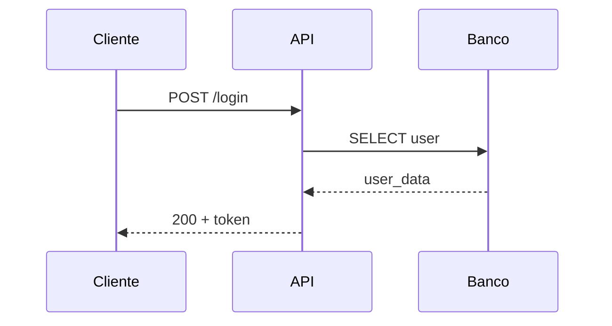

> *"Todo general precisa de um mapa antes da batalha. Diagramas de sequência são os meus."*

**Duração estimada:** ~30 min

## Vídeo introdutório

<video controls width="100%" preload="metadata">
	<source src="/copilot-na-pratica/videos/13-mapas-de-batalha.mp4" type="video/mp4" />
	Seu navegador não suporta vídeo HTML5.
</video>

## Pré-requisitos obrigatórios

Esta aula complementa os **Arquivos da Aliança** (aula 12). Enquanto Arquivos são **textuais** (regras, validações), Mapas de Batalha são **visuais** (fluxos, sequências de interação).

## O Problema Real: "Texto Solto Gera Interpretação Divergente"

Imagine que você descreve um fluxo assim:

```markdown
## Fluxo de Checkout
O cliente envia os dados do pedido para a API, que valida e chama o serviço de
checkout. O serviço reserva os itens no estoque, processa o pagamento e persiste
o pedido no banco. Se tudo der certo, retorna sucesso status status 201.
```

**3 desenvolvedores vão implementar 3 fluxos diferentes:**

| Desenvolvedor | Interpretação | Problema |
|---------------|---------------|----------|
| Dev A | Valida→Reserva→Paga→Persiste | ✅ Correto |
| Dev B | Paga→Reserva→Persiste→Valida | ❌ Paga antes de validar (risco!) |
| Dev C | Valida→Paga→Persiste (sem reservar estoque) | ❌ Esqueceu passo crítico |

**Por quê?** Texto linear não deixa claro:
- Ordem exata das operações
- Quem chama quem
- O que acontece em cada retorno
- Fluxos alternativos (erro, timeout)

**Diagrama de sequência resolve** mostrando VISUALMENTE e SEM AMBIGUIDADE:

```
Cliente -> API: POST /checkout
API -> CheckoutService: validar_pedido()
CheckoutService -> Estoque: reservar_itens()
Estoque --> CheckoutService: reserva_ok
CheckoutService -> Pagamento: processar_cobranca()
Pagamento --> CheckoutService: pagamento_aprovado
CheckoutService -> Banco: salvar_pedido()
Banco --> CheckoutService: pedido_id
CheckoutService --> API: sucesso
API --> Cliente: 201 + pedido
```

Agora está **cristalino**: validar → reservar → pagar → persistir, nessa ordem.

## 🗺️ O Que São Diagramas de Sequência

**Diagrama de sequência** (sequence diagram) = representação visual de **interações entre componentes ao longo do tempo**, mostrando:

1. **Participantes** (actors): Quem/o que participa (Cliente, API, Serviço, Banco)
2. **Mensagens** (setas): Chamadas de função, requests HTTP, queries
3. **Ordem temporal** (de cima para baixo): O que acontece primeiro, depois, por último
4. **Retornos** (setas tracejadas): Respostas de volta

**Exemplo visual:**

```
Cliente              API              CheckoutService      Estoque
  |                   |                      |                |
  |  POST /checkout   |                      |                |
  |------------------>|                      |                |
  |                   |  validar_pedido()    |                |
  |                   |--------------------->|                |
  |                   |                      | reservar()      |
  |                   |                      |--------------->|
  |                   |                      |  reserva_id    |
  |                   |                      |<---------------|
  |                   |  pedido_id           |                |
  |                   |<---------------------|                |
  |  201 + pedido     |                      |                |
  |<------------------|                      |                |
  |                   |                      |                |
```

**Por que usar:** Impossível interpretar errado quando a sequência está desenhada.

## 📁 Formato Adotado: WebSequenceDiagrams (.wsd)

**WebSequenceDiagrams** = formatointático de **texto** que vira diagrama visual. Vantagens:

| Característica | Benefício |
|----------------|-----------|
| **Texto puro** | Versionável no Git (diff legível) |
| **Sintaxe simples** | Aprende em 5 minutos |
| **Renderização automática** | Gera imagem PNG/SVG |
| **Editável** | Copilot pode ler e modificar |

**Extensão de arquivo:** `.wsd` (Web Sequence Diagram)

**Localização no projeto:**
```
docs/
  diagramas/
    fluxo-autenticacao.wsd
    fluxo-checkout.wsd
    fluxo-pagamento.wsd
    fluxo-estorno.wsd
```

## 📐 Sintaxe Básica do WebSequenceDiagrams

### Estrutura Mínima

```
title Nome Do Fluxo

participant Participante1
participant Participante2

Participante1->Participante2: mensagem
Participante2-->Participante1: resposta
```

### Elementos da Sintaxe

#### 1. Título do diagrama
```
title Fluxo de Autenticação
```
Aparece no topo do diagrama.

#### 2. Declaração de participantes
```
participant Cliente
participant API
participant AuthService
participant Banco
```

**participant** = ator/sistema no fluxo (caixa retangular no diagrama). Ordem de declaração define ordem visual (esquerda → direita).

#### 3. Mensagens síncronas (seta sólida →)
```
Cliente->API: POST /login
```
**Significa:** Cliente chama API e aguarda resposta (bloqueante).

#### 4. Respostas (seta tracejada -->)
```
API-->Cliente: 200 + token
```
**Significa:** Retorno da chamada anterior (não é nova chamada).

#### 5. Mensagens assíncronas (seta aberta ->>)
```
API->>FilaNotificacao: enfileirar_email
```
**Significa:** API dispara e NÃO aguarda (fire-and-forget).

#### 6. Nota explicativa
```
note over API: Valida JWT aqui
```
Adiciona comentário visual no diagrama.

#### 7. Grupos de fluxo alternativo
```
alt pagamento aprovado
    Pagamento-->CheckoutService: sucesso
else pagamento negado
    Pagamento-->CheckoutService: erro_pagamento
end
```
**Significa:** Condicional (if/else visual).

#### 8. Loops
```
loop para cada item
    CheckoutService->Estoque: reservar(item)
end
```

## 🎨 Exemplos Completos Prontos Para Usar

### Exemplo 1: Fluxo de Autenticação

Crie `docs/diagramas/fluxo-autenticacao.wsd`:

```
title Fluxo de Autenticação

participant Cliente
participant API
participant AuthService
participant Banco

Cliente->API: POST /auth/login\n(email, senha)

note over API: Valida formato\n(email válido, senha não vazia)

API->AuthService: validar_credenciais(email, senha)

AuthService->Banco: SELECT * FROM users\nWHERE email = ?

Banco-->AuthService: user_record + password_hash

note over AuthService: Compara bcrypt\nsenha vs hash

alt credenciais válidas
    AuthService->AuthService: gerar_jwt(user_id, expiry=24h)
    AuthService-->API: token JWT
    API-->Cliente: 200 OK\n{"token": "eyJ...", "expires_in": 86400}
else credenciais inválidas
    AuthService-->API: erro_autenticacao
    API-->Cliente: 401 Unauthorized\n{"detail": "Email ou senha inválidos"}
end
```

**Como usar:**
1. Salve arquivo
2. Ao pedir implementação: *"Implemente endpoint /auth/login conforme docs/diagramas/fluxo-autenticacao.wsd"*
3. Copilot lê o diagrama e implementa fluxo exato

### Exemplo 2: Fluxo de Checkout Completo

Crie `docs/diagramas/fluxo-checkout.wsd`:

```
title Fluxo de Checkout (Caso Feliz + Erros)

participant Cliente
participant API
participant CheckoutService
participant Estoque
participant Pagamento
participant Banco

Cliente->API: POST /checkout\n{"items": [...], "payment_method": "credit_card"}

API->CheckoutService: iniciar_checkout(dados)

note over CheckoutService: Valida:\n- Items não vazios\n- Payment method válido\n- Customer autenticado

CheckoutService->Estoque: reservar_itens(items)

alt estoque disponível
    Estoque-->CheckoutService: reserva_id
    
    CheckoutService->Pagamento: cobrar(valor, payment_method)
    
    alt pagamento aprovado
        Pagamento-->CheckoutService: cobranca_id
        
        CheckoutService->Banco: INSERT INTO pedidos\n(customer_id, items, total, status='pago')
        
        Banco-->CheckoutService: pedido_id
        
        CheckoutService->Estoque: confirmar_reserva(reserva_id)
        
        CheckoutService-->API: sucesso(pedido_id)
        API-->Cliente: 201 Created\n{"pedido_id": 123, "status": "pago"}
        
    else pagamento negado
        Pagamento-->CheckoutService: erro_pagamento
        CheckoutService->Estoque: cancelar_reserva(reserva_id)
        CheckoutService-->API: erro_pagamento
        API-->Cliente: 402 Payment Required\n{"detail": "Cartão recusado"}
    end
    
else estoque insuficiente
    Estoque-->CheckoutService: erro_estoque
    CheckoutService-->API: erro_estoque
    API-->Cliente: 409 Conflict\n{"detail": "Item X sem estoque"}
end
```

**Pontos críticos visualizados:**
- ✅ Reserva de estoque ANTES de cobrar (evita vender item sem estoque)
- ✅ Se pagamento falhar, cancela reserva (libera estoque)
- ✅ Persistência só ocorre APÓS pagamento aprovado
- ✅ Fluxos alternativos claros (estoque insuficiente, pagamento negado)

### Exemplo 3: Fluxo Assíncrono com Fila

Crie `docs/diagramas/fluxo-notificacao-async.wsd`:

```
title Fluxo de Notificação Assíncrona

participant API
participant FilaRedis
participant WorkerCelery
participant SendGrid
participant Banco

API->>FilaRedis: enfileirar_email\n{"user_id": 123, "template": "pedido_criado"}

note over API: API retorna imediatamente\n(não aguarda envio)

API-->Cliente: 201 Created (pedido criado)

...Worker processa em background...

FilaRedis->>WorkerCelery: próxima_tarefa()

WorkerCelery->Banco: SELECT email, name\nFROM users WHERE id = 123

Banco-->WorkerCelery: user_data

WorkerCelery->SendGrid: send_email(\nto=user_data.email,\ntemplate="pedido_criado")

alt email enviado
    SendGrid-->WorkerCelery: message_id
    WorkerCelery->Banco: INSERT INTO notification_history\n(status='sent')
else erro temporário (rate limit)
    SendGrid-->WorkerCelery: erro_rate_limit
    note over WorkerCelery: Retry após 60s\n(máximo 3 tentativas)
    WorkerCelery->>FilaRedis: reenfileirar_com_delay(60s)
end
```

**Visualiza:**
- ✅ API não bloqueia esperando email
- ✅ Worker processa assíncrono
- ✅ Retry logic para falhas temporárias

## 🔧 Como Tornar Diagramas Consumíveis Pela IA

### Método 1: Anexar ao Chat do Copilot

```
Você no chat:
"Implemente o endpoint conforme o fluxo em docs/diagramas/fluxo-checkout.wsd.

Pontos críticos a observar:
- Reservar estoque ANTES de cobrar
- Cancelar reserva se pagamento falhar
- Retornar 409 se estoque insuficiente"
```

Copilot lê o arquivo `.wsd` e implementa seguindo sequência exata.

### Método 2: Referenciar em Pergaminhos

Em `docs/business-rules/checkout-fluxo.md`:

```markdown
# Regra de Negócio — Fluxo de Checkout

## Diagramas de Referência
Veja `docs/diagramas/fluxo-checkout.wsd` para sequência completa.

## Ordem Obrigatória
1. Validar dados de entrada
2. **PRIMEIRO:** Reservar itens no estoque
3. **DEPOIS:** Processar pagamento
4. **SÓ ENTÃO:** Persistir pedido

## Rollback em Falha
Se pagamento falhar APÓS reserva, DEVE cancelar reserva para liberar estoque.
```

### Método 3: Gerar Código Diretamente do Diagrama

Prompt especializado:

```
"Gere código Python para CheckoutService seguindo EXATAMENTE a sequência em docs/diagramas/fluxo-checkout.wsd.

Requisitos:
- Uma função por chamada mostrada no diagrama
- Try/except para fluxos 'alt' (erros)
- Comentários indicando qual parte do diagrama está sendo implementada"
```

Copilot gera código como:

```python
class CheckoutService:
    def iniciar_checkout(self, dados: CheckoutData) -> Pedido:
        """
        Implementa fluxo conforme docs/diagramas/fluxo-checkout.wsd
        """
        # Diagrama: CheckoutService->Estoque: reservar_itens
        try:
            reserva_id = self.estoque.reservar_itens(dados.items)
        except EstoqueInsuficienteError:
            # Diagrama: alt estoque insuficiente
            raise HTTPException(409, "Item sem estoque")
        
        # Diagrama: CheckoutService->Pagamento: cobrar
        try:
            cobranca_id = self.pagamento.cobrar(dados.valor, dados.payment_method)
        except PagamentoNegadoError:
            # Diagrama: alt pagamento negado -> cancelar_reserva
            self.estoque.cancelar_reserva(reserva_id)
            raise HTTPException(402, "Cartão recusado")
        
        # Diagrama: CheckoutService->Banco: INSERT pedido
        pedido = self.banco.criar_pedido(
            customer_id=dados.customer_id,
            items=dados.items,
            status="pago"
        )
        
        # Diagrama: CheckoutService->Estoque: confirmar_reserva
        self.estoque.confirmar_reserva(reserva_id)
        
        return pedido
```

## 💡 Quando Criar Um Diagrama vs Usar Texto

Use esta tabela de decisão:

| Situação | Recurso | Por quê |
|----------|---------|---------|
| Fluxo linear simples (1-3 passos) | **Texto** em Pergaminho | Diagrama seria overkill |
| Fluxo com 4+ passos e múltiplos retornos | **Diagrama** | Ordem crítica, difícil descrever |
| Múltiplos fluxos alternativos (if/else) | **Diagrama (com alt)** | Visualiza condições claramente |
| Interação assíncrona (filas, events) | **Diagrama** | Mostra não-bloqueio visualmente |
| Regra de validação simples | **Texto** | Ex: "Campo X obrigatório" |
| Orquestração entre 3+ serviços | **Diagrama** | Quem chama quem fica explícito |

**Exemplo de quando NÃO usar diagrama:**

```markdown
## Validação de Email
Campo `email` deve:
- Ser obrigatório
- Ter formato válido (regex: ^[a-z0-9._%+-]+@[a-z0-9.-]+\.[a-z]{2,}$)
- Ter domínio não-descartável (não pode ser mailinator.com, etc)
```
→ Texto é suficiente (não tem sequência de interações).

**Exemplo de quando USAR diagrama:**

```markdown
## Fluxo de Recuperação de Senha
1. Cliente solicita recuperação
2. API valida email exists
3. Envia código por email
4. Cliente submete código + nova senha
5. API valida código e expira
6. Atualiza senha no banco
```
→ Melhor como diagrama (6 passos com interações entre 4+ components).

## 🛠️ Ferramentas Para Criar e Visualizar Diagramas

### Online: WebSequenceDiagrams.com

1. Acesse https://www.websequencediagrams.com/
2. Cole sintaxe `.wsd` na área de texto
3. Clique "Draw" → vê diagrama renderizado
4. Copie sintaxe de volta para arquivo `.wsd` no projeto

### VS Code Extension: PlantUML

PlantUML é alternativa ao WSD (sintaxe um pouco diferente mas mais poderosa).

```bash
# Instalar extensão
code --install-extension jebbs.plantuml
```

Permite preview inline no VS Code ao abrir `.puml` files.

### Mermaid (alternativa moderna)

Mermaid está integrado ao GitHub (renderiza automático em Markdown).

**Sintaxe Mermaid:**
```markdown

```

**Vantagem:** Renderiza direto no README.md do GitHub  
**Desvantagem:** Sintaxe ligeiramente diferente (mas Copilot entende ambas)

**Escolha do projeto:** Use **WSD (.wsd)** por ser mais simples, ou **Mermaid** se preferir renderização nativa no GitHub.

## 💡 Troubleshooting Comum

### Problema: Diagrama fica muito complexo (10+ participantes)

**Sintomas:** Diagrama gigante, difícil de ler.

**Solução:** **Quebre em múltiplos diagramas por fase:**

```
# Ao invés de um diagrama massivo:
fluxo-checkout-completo.wsd (15 participantes, 50 mensagens)

# Crie 3 diagramas focados:
fluxo-checkout-fase1-validacao.wsd      (3 participantes)
fluxo-checkout-fase2-pagamento.wsd      (4 participantes)
fluxo-checkout-fase3-confirmacao.wsd    (3 participantes)
```

**Regra prática:** Máximo 6 participantes por diagrama. Se ultrapassar, divida.

### Problema: Copilot não está considerando o diagrama

**Diagnóstico:**
Peça explicitamente: *"Você leu o arquivo docs/diagramas/fluxo-checkout.wsd?"*

**Soluções:**
- ✅ Referencie explicitamente no prompt: *"conforme docs/diagramas/fluxo-checkout.wsd"*
- ✅ Cole trecho do diagrama no chat se arquivo não for lido
- ✅ Verifique que arquivo está commitado no Git (arquivos não commitados podem não ser indexados)

### Problema: Não sei se preciso criar diagrama para determinado fluxo

**Checklist de decisão:**

```markdown
Crie diagrama se responder SIM para 2+ itens:
- [ ] Fluxo tem 4+ passos sequenciais?
- [ ] Múltiplos serviços/componentes interagem?
- [ ] Existe fluxo alternativo (if/else, error handling)?
- [ ] Interação assíncrona (fila, evento)?
- [ ] Time tem confusão sobre ordem das operações?
- [ ] Fluxo muda frequentemente (diagrama ajuda a comunicar mudanças)?
```

Se respondeu SIM para 0-1: Texto em Pergaminho provavelmente basta.

### Problema: Diagrama desatualizado (código mudou mas diagrama não)

**Prevenção:** Mesmo checklist de PR dos Pergaminhos:

```markdown
## PR Checklist
- [ ] Se mudança de fluxo: Atualizei docs/diagramas/.wsd correspondente
```

**Validação automática:** Configure CI que detecta mudança em service mas não no diagrama:

```yaml
# .github/workflows/check-diagrams.yml
- name: Check if diagram updated
  run: |
    if git diff --name-only origin/main | grep -q "app/services/checkout.py"; then
      if ! git diff --name-only origin/main | grep -q "docs/diagramas/fluxo-checkout"; then
        echo "WARNING: Checkout service mudou. Revisar se diagrama precisa atualizar."
        # Não falha CI, apenas avisa
      fi
    fi
```

## 📝 Exercício Prático Completo

**Missão:** Crie diagrama de sequência para **"Fluxo de Estorno de Pagamento"**.

### Requisitos do Fluxo

1. Cliente solicita estorno de pedido já pago
2. API valida que pedido existe e é elegível (< 7 dias)
3. Se elegível automático (valor < R$ 100): aprova direto
4. Se precisa aprovação manual (valor >= R$ 100): envia para fila de aprovação
5. Após aprovação, processa estorno no gateway de pagamento
6. Atualiza status do pedido para "estornado"
7. Notifica cliente por email (assíncrono)

### Tarefa

1. **Identifique participantes:**
   - Cliente, API, EstornoService, Banco, GatewayPagamento, FilaAprovacao, NotificacaoWorker
   
2. **Crie** `docs/diagramas/fluxo-estorno.wsd` com:
   - Sequência completa
   - Fluxos alternativos (alt) para aprovação automática vs manual
   - Notificação assíncrona (->> fila)
   - Retornos adequados (201, 202, 400, 404)

3. **Teste:** Peça ao Copilot *"Implemente EstornoService seguindo docs/diagramas/fluxo-estorno.wsd"*

4. **Valide:** Código gerado seguemesma ordem do diagrama?

**Critério de sucesso:**
- ✅ Diagrama renderiza corretamente (teste em websequencediagrams.com)
- ✅ Fluxos alternativos claros (aprovação automática vs manual)
- ✅ Notificação assíncrona visível (não bloqueia resposta)
- ✅ Copilot gera código seguindo sequência exata

## 🎯 Próxima Missão

Na próxima aula (**Holocrons Vivos**) você aprenderá a manter documentação **sincronizada automaticamente** com código. Enquanto Mapasde Batalha documentam fluxos planejados, Holocrons Vivos garantem que a documentação reflita o **estado atual real** do sistema.

:::tip 🏆 Treinamento Jedi Completo
Você domina Mapas de Batalha (diagramas de sequência) e sabe transformar fluxos complexos em visualizações precisas que eliminam ambiguidade. Agora o Copilot (e seu time) entendem exatamente a ordem de operações sem margem para interpretação divergente.
:::
